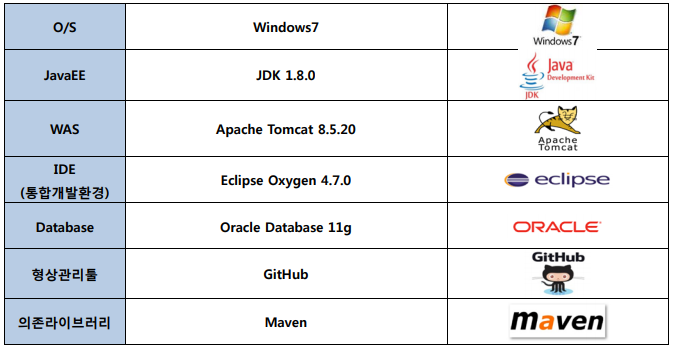
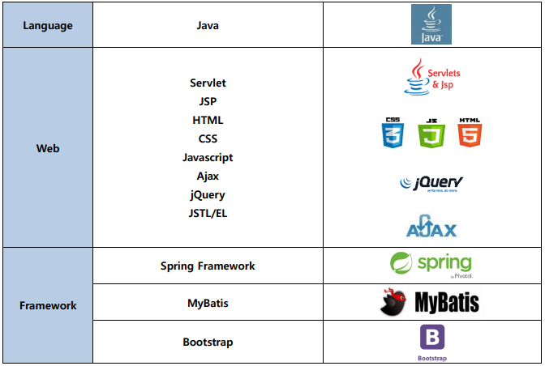

# 프로젝트 
KOSTA 163기 Final Project
Spring Framework 기반 Java 웹 서비스 개발 

### 개발기간 
2017.11.13~2017.12.09

# 서비스 개요
## 서비스명
반찬창고

## 개요
집에서 일하시는 주부들이 소일거리로 자신의 음식 솜씨를 이용하여 음식을 공유하고 부수입을 얻을 수 있는 음식 쉐어링 플랫폼
## 대상
판매자: 주부, 요리를 좋아하는 사람들
소비자: 자취생, 직장인 등 집에서 요리할 시간이 없는 사람들
## 목적
1)	중 장년 주부들이 자신의 음식솜씨를 공유하며 동시에 부수입을 얻음으로써 주부들의 경력단절을 해소하고 사회활동을 권장한다.
2)	집에서 음식을 해먹기 어려운 자취생이나 직장인들이 본인들의 집 주변 주부들이 직접 만든 음식을 저렴한 가격에 구입해 먹을 수 있다.
## 서비스 프로세스
반찬창고 사이트에서 원하는 판매자가 등록한 판매음식 중 원하는 것을 구매한다. 거래일자에 지정한 장소에서 판매자는 음식을 전달하고 구매자는 돈을 지불하여 거래한다. 
## 기능
[비회원] 서비스 소개 및 판매음식 확인  
[구매자] 자신의 위치를 기반으로 판매음식 확인 및 구매예약 후 실제 거래  
[판매자] 음식등록 및 판매음식등록 후 실제 거래 후 이익 창출

=> 구매자와 판매자의 음식거래

# 개발환경
  

# 적용기술
 